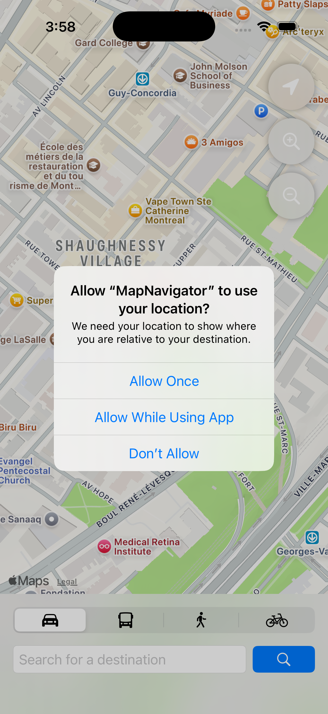
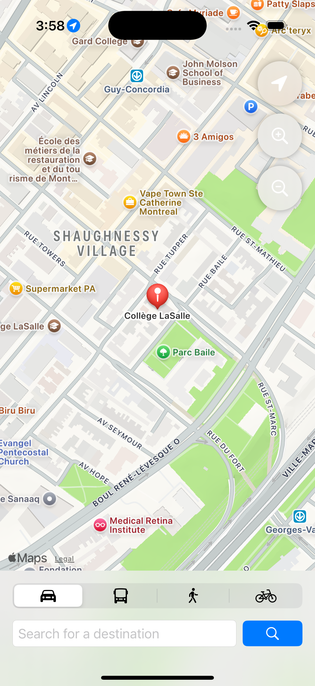
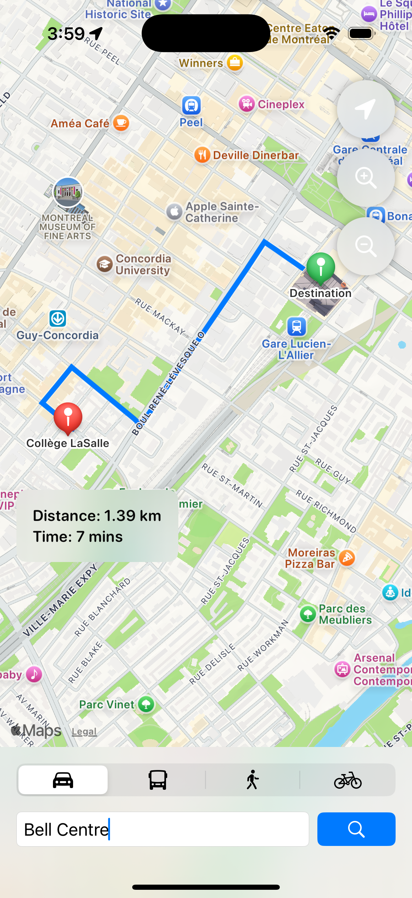
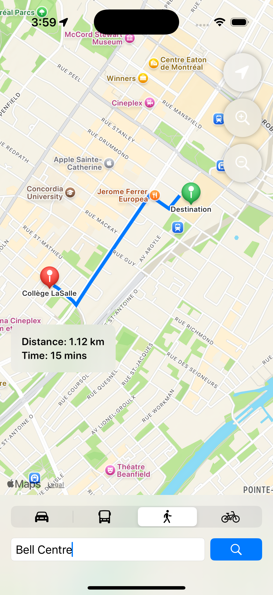

# Midterm Assessment 5 - iOS Development II

## Project Overview
An iOS application built with **SwiftUI** and **MapKit** that provides real-time navigation and route calculation from a fixed starting point (Collège LaSalle Montréal). This project demonstrates proficiency in CoreLocation, MapKit's new SwiftUI API, and custom map interactions.

## Key Features
* **Default Location:** Automatically centers on Collège LaSalle ($45.4919, -73.5794$) upon launch.
* **User Tracking:** Requests location permissions to display a "You" marker using `CoreLocation`.
* **Custom Zoom Logic:** Floating zoom controls that scale the map relative to the current camera center rather than the user's position.
* **Destination Search:** Integrated `MKLocalSearch` allows users to find locations via a search bar.
* **Multi-Modal Routing:** Supports Automobile, Transit, Walking, and Cycling modes with automatic route recalculation.
* **Dynamic UI:** Displays distance in kilometers and estimated travel time in a blurred overlay.

## Technical Implementation
* **Frameworks:** SwiftUI, MapKit, CoreLocation.
* **Architecture:** MVVM-style with a `LocationManager` class handling delegate methods for authorization and coordinate updates.
* **API Usage:** Utilizes `MapPolyline` for route drawing and `MapCameraPosition` for programmatic camera movements.

## Screenshots

| 1. App Launch & Permissions | 2. Default Location View |
|:---:|:---:|
|  |  |
| *System prompt for location access.* | *Centered on Collège LaSalle Montréal.* |

| 3. Route Calculation | 4. Multi-Modal Transport |
|:---:|:---:|
|  |  |
| *Automobile route to Bell Centre.* | *Walking route with updated time/path.* |
